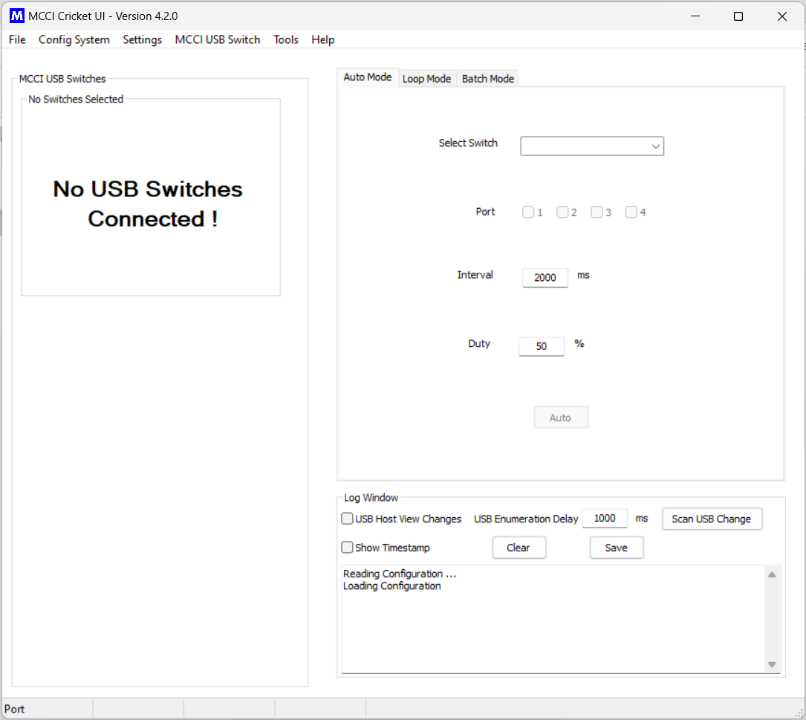
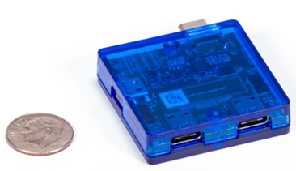
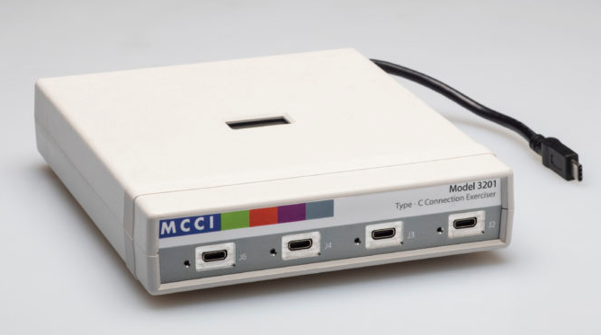
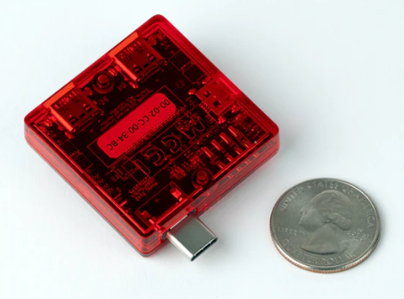
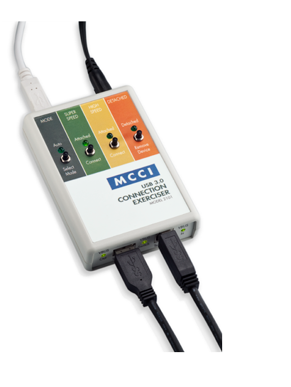
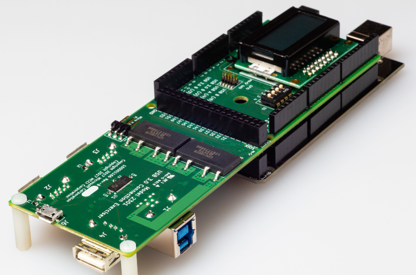

# Cricket UI

This repository contains the source code for Cricket UI, a standalone desktop application for interactively controlling [MCCI USB Switches](https://store.mcci.com/collections/usb-switches) in a convenient way. The application supports MCCI Model 3141,3142, 3201, 2301 and 2101 USB Switches.

**Note:** Prepackaged, signed releases are available at [`COLLECTION-Cricket-UI/releases`](https://github.com/mcci-usb/COLLECTION-cricket-ui/releases). Only use this repository directly if you want to do source code development.

[](https://github.com/mcci-usb/COLLECTION-cricket-ui/releases/) [](https://github.com/mcci-usb/COLLECTION-cricket-ui/compare/version400...master)
<!-- markdown-shield -->

## List of Contents

<!-- TOC depthfrom:2 updateonsave:false -->

- [List of Contents](#list-of-contents)
- [About the Application](#about-the-application)
- [Prerequisites for running or building](#prerequisites-for-running-or-building)
  - [Windows](#windows)
  - [Ubuntu](#ubuntu)
  - [MacOS](#macos)
  - [Raspberry Pi](#raspberry-pi)
- [Cricket API Library](#cricket-api-library)
  - [How to use the package](#how-to-use-the-package)
- [Running the code](#running-the-code)
- [Version change process](#version-change-process)
- [GUI Preview](#gui-preview)
- [Supported Products](#supported-products)
  - [MCCI Model 3141 USB4 Switch](#mcci-model-3141-usb4-switch)
  - [MCCI Model 3201 Enhanced Type-C 4-Port USB Switch](#mcci-model-3201-enhanced-type-c-4-port-usb-switch)
  - [MCCI Model 3142 USB4 Switch](#mcci-model-3142-usb4-switch)

  - [MCCI Model 2101 USB Connection Exerciser](#mcci-model-2101-usb-connection-exerciser)
  - [MCCI Model 2301 4-Port USB Connection Exerciser](#mcci-model-2301-4-port-usb-connection-exerciser)
- [Release History](#release-history)
- [Meta](#meta)
  - [Copyright and License](#copyright-and-license)
  - [Support Open Source Hardware and Software](#support-open-source-hardware-and-software)
  - [Trademarks](#trademarks)

<!-- /TOC -->

## About the Application

This application is a simple user interface for MCCI USB Switches. It supports manual and automated testing of USB hosts and devices, by automatically connecting and disconnecting USB devices and tracking results.

## Prerequisites for running or building

### Windows

Development environment

* OS - Windows 10 64 bit
* Python - 3.7.6
* wxPython - 4.0.7.post2
* pyserial - 3.4
* pyusb - 1.0.2
* hidapi - 0.11.2
* matplotlib - 1.16.0

Download [python3.7.6](https://www.python.org/downloads/release/python-376/) and install.

```shell
pip install wxpython==4.0.7.post2
pip install pyserial
pip install pyusb
pip install hidapi == 0.11.2
pip install matplotlib
```

### Ubuntu

Development environment

* Linux OS - Ubuntu 20.04 64 bit
* Python - 3.8.2
* wxPython - 4.0.7.post2
* pyserial - 3.4
* pyusb - 1.0.2
* libusb - 1.0.22b9
* libusb1 - 1.8
* hidapi - 0.11.2
* matplotlib - 3.5

```bash
sudo apt-get update
sudo apt-get install python3
sudo apt-get install python3-pip
sudo pip3 install wxpython==4.0.7.post2
sudo pip3 install pyserial
sudo pip3 install pyusb
sudo pip3 install libusb
sudo pip3 install libusb1
sudo pip3 install hidapi == 0.11.2
sudo pip3 install matplotlib
```

Note:

* If the installation of wxPython does not succeed, try `sudo apt-get install build-essential libgtk-3-dev`
* Sometimes the installation of wxPython takes a long time (>30 minutes).

### MacOS

Development environment

* Mac OS - Catalina 10.15.7 64 bit
* Python - 3.6.9
* wxPython - 4.0.7.post2
* pyserial - 3.4
* pyusb - 1.0.2
* libusb - 1.0.22b9
* libusb1 - 1.8
* matplotlib - 3.2.2
* hidapi - 0.11.2

```bash
sudo apt-get update
sudo apt-get install python3
sudo apt-get install python3-pip
sudo pip3 install wxpython==4.0.7.post2
sudo pip3 install pyserial
sudo pip3 install pyusb
brew install libusb
sudo pip3 install libusb1
sudo pip3 install matplotlib
brew install hidapi - Only for Mac OS
```

### Raspberry Pi

Development environment

* Raspberry Pi OS - aarch64 in Ubuntu 20.04 bit
* Python - 3.6.9
* wxgtk-4.0
* pyserial - 3.5
* pyusb - 1.1.1
* libusb - 1.0.23b7
* libusb1 - 1.9
* hidapi - 0.11.2
* matplotlib - 1.14.0

```bash
sudo add-apt-repository ppa:swt-techie/wxpython4
sudo apt-get update
sudo apt-get install python3-wxgtk4.0
sudo pip3 install pyserial
sudo pip3 install pyusb
sudo pip3 install libusb
sudo pip3 install libusb1
sudo pip3 install hidapi==0.11.2
sudo pip3 install matplotlib
```

Note:

* If the installation of wxPython does not succeed, try `sudo apt-get install build-essential libgtk-3-dev`

## Cricket API Library

`cricketlib` api is a python library, this libabry intract with `Cricket UI`

* download the cricketlib from here [crickelib](https://github.com/mcci-usb/cricketlib)

* To install the library using below command and [install package](https://github.com/mcci-usb/cricketlib#installing-cricketlib-package) in Windows OS.

```shell
python setup.py install
```
* To install the library using below command and [install package](https://github.com/mcci-usb/cricketlib#installing-cricketlib-package) in Linux OS

```shell
sudo python3 setup.py install
```
* To install the library using below command and [install package](https://github.com/mcci-usb/cricketlib#installing-cricketlib-package) in MacOS

```shell
sudo python3 setup.py install
```


Please navigate to dist/ directory and you will find the files .egg file. Example: cricketapi-1.0.6-py3.7.egg

### How to use the package

here provide the REAMDME.md information about cricket lib please follow the instrunctions [README](https://github.com/mcci-usb/cricketlib#package-usage)

## Running the code

Move to the directory `destdir/src/`

Run the below command

For Windows:

```shell
python main.py
```

For Linux

```bash
python3 main.py
```

For Mac

```bash
python3.6 main.py
```

For Raspberry Pi

```bash
python3 main.py
```

## Version change process

To update the version for each release

* Move to the directory `destdir/src/`
* Open the file `uiGlobals.py`
* Update the value of the String Macro `APP_VERSION`
* Update the VERSION.md `destdir/VERSION.md`

## GUI Preview



## Supported Products

### MCCI Model 3141 USB4® Switch

* The Model 3141 USB4 Switch is a computer-controlled programmable 2:1 switch, connecting two USB Type-C® receptacles to a single USB-C® plug. It is compatible with USB4 hosts and devices, as well as older protocols such as Thunderbolt™ 3, USB 3.2 gen2 or gen1, USB 2.0, USB Type-C Alternate Modes, and of course Power Delivery.
It can be used in stress testing, switching between peripherals (for example, a dock and a display), or any automated reconfiguration of a USB Type-C port

  **Link:** For more information, see the [product home page](https://mcci.com/usb/dev-tools/model-3141/).

  

### MCCI Model 3201 Enhanced Type-C 4-Port USB Switch

* The MCCI Model 3201 (MUTT ConnEX-C) plugs and unplugs up to 4 devices for automated testing of USB Type-C® products. Developed in conjunction with Microsoft, the 3201 is upward compatible with the MCCI Model 3101/Model 3201 Connection Exercisers and the Microsoft MUTT ConnEx-C, but has a number of significant enhancements and improvements.

 **Link:** For more information, see the [product home page](https://mcci.com/usb/dev-tools/3201-enhanced-type-c-connection-exerciser/)

   

### MCCI Model 3142 USB4 Switch

* The MCCI® Model 3142 USB4 Switch is a computer-controlled programmable 2:1 switch, connecting two USB Type-C® receptacles to a single Type-C plug. It is compatible with USB4 hosts and devices at signaling rates up to 40 gigabits/second, as well as other protocols such as Thunderbolt™ 4, Thunderbolt™ 3, USB 3.2, USB 2.0, USB Type-C Alternate Modes, and of course USB Power Delivery. It also supports Extended Power Range (EPR) sources and sinks, allowing it to be used with source and sinks at up to 48V at 5A.

**Link:** For more information, see the product home page at [MCCI USB4 Switch 3142](https://store.mcci.com/products/model3142?variant=41002882072687).

  

### MCCI Model 2101 USB Connection Exerciser

The MCCI USB 3.0 Connection Exerciser MCCI USB Switch 2101 automatically connects and disconnects a USB 2.0 or 3.2 gen1 host and device under push-button or software control. Connections can be single-stepped or repeated. The manual modes are useful for debugging attach/detach scenarios.
The MCCI USB 3141 USB4 Switch automates connect/disconnect of one or two devices to a USB Type-C port. It can be used in stress testing, switching between peripherals (for example, a dock and a display), or any automated reconfiguration of a USB Type-C port

 **Link:** For more information, see the product home page at [MCCI USB Switch 2101](https://mcci.com/usb/dev-tools/2101-usb-connection-exerciser/).

  

### MCCI Model 2301 4-Port USB Connection Exerciser

The MCCI USB Switch 2301 Type-A Connection Exerciser provides a four-to-one USB switch to automate interoperability tests for systems USB 3.2 gen1 or gen2. It uses the supplied Arduino-based controller and electronic switches to electrically plug and unplug any of the four different input ports. The Gen2-capable Type-B plug can be connected to either of two Type-A receptacles, to a Standard-A receptacle (USB 2.0 only), or a Micro-B receptacle (USB 2.0 only). The Type-A Gen2 receptacles support USB 3.2 (gen 1 and gen 2) and USB 2.0 (high speed, full speed and low-speed) devices. The Standard-A receptacle supports USB 2.0 devices. . For more information, see the product home page at www.mcci.com.

 **Link:** For more information, see the product home page at [MCCI USB Switch 2301](https://mcci.com/usb/dev-tools/model-2301/).

 

## Release History

- v4.0.0 is major release  it Contains the following changes
  - Added support for MCCI USB Switch 3142 [#103 Cricket UI Supports Swicth3142](https://github.com/mcci-usb/Cricket/commit/b7acf28e340d8c7cdda6a4772055c1362488447b).

  - Firmware update feature added for 3141 and 3142[#104 Add firmware update support through USB Serial for 3141 and 3142 USB Swicth](https://github.com/mcci-usb/Cricket/commit/6fea68935fb8f227c62df145e48d15ba307f0d72).

  - USB VBUS VI Plot improved[#105 Adding VI chart support for Switch3142](https://github.com/mcci-usb/Cricket/commit/c1009b093b1615b04c87700c341fce090daab548) .

- v3.1.0 is patch release it contains the following changes
  - Added for TB4 speed Support in Mac [#96 Support TB4 speed](https://github.com/mcci-usb/Cricket/commit/273f01cb61966654b09ddd80f9b2cbbd88d67c4d)
  - Showing of warning dialog in batch mode [#99](https://github.com/mcci-usb/Cricket/commit/a51470a69123ab6b89b3abf7501c1ceee7b1f441)
  - Increase of minimum delay from 500 msec to 1000 msec [#100](https://github.com/mcci-usb/Cricket/commit/9c8029d657ab46589acc1217d6ad1a95b3f8cbd5)
  - Add delay when switch ports[#98](https://github.com/mcci-usb/Cricket/commit/4237cd4baec8a19552d527c3c9d6be07d972c73d)

- v3.0.0 is major release  it Contains the following changes
  - Incorrect view showing in Log window while using USB4 hub [#77](https://github.com/mcci-usb/Cricket/commit/1d78e766a38564262e1964d315f60cccc76324ca)
  - supporting of Thunderbolt device tree view [#78](https://github.com/mcci-usb/Cricket/commit/c0c5404794678247bcc943e77c2266a53113c875)
  - Segmentation Fault11 [#79](https://github.com/mcci-usb/Cricket/commit/a5c2933f2ec89c8e2610dfd78d39a3552c9af1e1)
  - No switch connected on Linux; UI seems to show a 2101 [#80 #81 #83](https://github.com/mcci-usb/Cricket/commit/bcf0d7ba15c50ceff568c4d2f3f158ec7ff211b8)

  - DUT related issues [#90](https://github.com/mcci-usb/Cricket/commit/7c2e7b2e1c6ebee246b30b06c7e637b8977fc314)
  - Connecting to switch with manual control doesn't reflect switch state [#64](https://github.com/mcci-usb/Cricket/commit/26e89016305b4793a1ba2b845c927dae74b9e0cb)
  - Read port status [#91](https://github.com/mcci-usb/Cricket/commit/9276c52454e9f99fdcfcce17e0ed984e02ac1a6d)
  - Alternate duty cycle calculation [#92](https://github.com/mcci-usb/Cricket/commit/38fedac7fee8d47e6630a9ce78d566b2a2cd06ef)

- v2.7.1 is a patch release
- v2.7.0 is a patch release.
  - Cricket UI fails to launch on ubuntu 20.04 and 22.04
- v2.6.1 is a patch release.
  - update the version tag [#75](https://github.com/mcci-usb/Cricket/commit/60b52983a71e6fd05813e7bd727a9ba21e261eb8)
- v2.6.0 is a patch release.
  - Device search dialog goes blank until complete the search [#70](https://github.com/mcci-usb/Cricket/commit/7fe8957ab618dff0510e72076c24afb81a85fb51)
  - App not responding when other com port devices(that are not MCCI USB Switches) are attached to the system USB & Slow search for switches [#59](https://github.com/mcci-usb/Cricket/commit/829d85818beb533114423fbdb848013c3c66eb0a) [#65](https://github.com/mcci-usb/Cricket/commit/829d85818beb533114423fbdb848013c3c66eb0a)
  - Minimizing and maximizing the application [#60](https://github.com/mcci-usb/Cricket/commit/f6bb6a8a79cf8ccf69931c288e1e417574cf8fe4)
  - Disable VBUS V/I monitor if switch doesn't support [#63](https://github.com/mcci-usb/Cricket/commit/2c569d5131f1f04fa3e802f67e04ded35b80b802)
  - misspelling in the log window instead of Switch it was spelled as Swicth [#61](https://github.com/mcci-usb/Cricket/commit/1344384596efdfd3288ef40bea38c8149b2039f6).
- v2.5.0 is major release it Contains the following changes
  - Feature added – Plotting of VBUS Volt and Current `VBUS V/I Plotting` [#18 #48 #52](https://github.com/mcci-usb/Cricket/commit/eb30f3b4a2e1da2c21db470315a8489b19d7b87d).
  - USB Tree view removed and merged with Log Window `Replaced USB Tree view window to Log Window` [#24](https://github.com/mcci-usb/Cricket/issues/24).
  - Perform device Search in advance, Device searching automatically or manually searching the device `USB Switch Scanning` [#30](https://github.com/mcci-usb/Cricket/issues/30).
  - Auto mode improved (Port selection provided) `Port(s) selection` [#22](https://github.com/mcci-usb/Cricket/issues/22) also with out port selection start auto pop-pp window appears `PopUp window` [`#Auto Popupwindow`](https://github.com/mcci-usb/Cricket/commit/f44494cc7b4295b10480be373afbf4987dc6383f).
  - Linux machine IP scanning issue fixed `Scanning ip address from Linux machine` [#20](https://github.com/mcci-usb/Cricket/issues/20).
  - The word Model replace by MCCI USB Switch `Replace MCCI USB Switch` [#27](https://github.com/mcci-usb/Cricket/issues/27).
  - UI not responding issued fixed `UI not Responding` [#28](https://github.com/mcci-usb/Cricket/issues/28).
  - Do not disable Manage Model>Connect when connected allow the user to directly connect to another switch `Connect menu` [#30](https://github.com/mcci-usb/Cricket/commit/d3077b5b2925553a505955d5721673705438d464).
  - Enhancement – Highlight the name of the     Switch `Highlet Switch` [#29](https://github.com/mcci-usb/Cricket/issues/29).
  - added Finished count in Loop Mode `Finished Count` [#23](https://github.com/mcci-usb/Cricket/issues/23).
  - Persistence of last connect `Last device connect`[#43](https://github.com/mcci-usb/Cricket/commit/2bf73805fe274e27fb775b18c4bc639828a60347)
  - Application hangs when closing the application on macOS using Quit command [#40](https://github.com/mcci-usb/Cricket/commit/2e34f30771b6dbfcf5c6bc7de9da4db7e0b7f8bb).
  - click on the settings menu, then click on the "Switch Control Computer" sub menu, this should display a dialog for searching the Computer over the network based on the port assigned for that. But dialog does not appearing `SCC and THC Setting menu search dialog not displayed - In Mac Catalian and Monterey` [#41](https://github.com/mcci-usb/Cricket/commit/e114a2bf9bb13968388f2e898b21dc2c6913edbd).
  - UI panel are not centralized `fixed UI in Central on window` [45](https://github.com/mcci-usb/Cricket/commit/755384805f0d05bce7fff4d0089f664812314f94).
  - Port selection should be disable state once the Auto mode execution get started, then the required ports are should be enabled when auto mode gets stopped `Disable the port selection when auto mode is under execution` [#50](https://github.com/mcci-usb/Cricket/commit/e45dac8e266632c75c72a7e88318fcec9a309f3c)
  - update Cricket UI Windows.spec file with One directory file `Update Cricket-Windows.spec file` [#47](https://github.com/mcci-usb/Cricket/commit/e6cfdb6fcab0714af319b37243b0895af50a4dfc).

  - Update year in the copy right info `Update copy right info in About dialog` [#53](https://github.com/mcci-usb/Cricket/commit/3530af09d231fc8ae9ffc6f47fd29bcfea5a329e)

- v2.4.0 is major release; changes are significant to networking using TCP/IP.
  - Add new feature support for Three computer System and Two Computer `Two and Three Computer system through Networking` [#14](https://github.com/mcci-usb/Cricket/pull/14/commits/931f867960b375b07b980b61e39ab32bba4dfb35).

- v2.3.0 is major release has following changes.
  - Add support for MCCI Switch 2301 USB Connection Exerciser ` MCCI USB Switch 2301 ` [#4](https://github.com/mcci-usb/Cricket/pull/4).

- v2.2.0 has following changes:

  - Python implemented to Pep8 coding standard ` MCCI USB Switch 2301 ` [#5](https://github.com/mcci-usb/Cricket/pull/5).
  - Package release for Raspberry Pi OS ubuntu18.04

- v2.0.0 is a major release.

  - Interface for USB Switch 2101 added
  - Radio buttons for Port switching replaced by  image added buttons,
  - Duty parameter added in auto mode,
  - Until stopped and Port selection option added to the Loop mode and separate panel for Auto mode added,
  - adding USB speed info, increase port switching speed.

- v1.2.0 has following changes

  - Host Controller issue and Delay override

- v1.0.2 is a changes to menu option

  - Mac Menu Update

- v1.0.0 initial release of cricket UI

  - Initial Release

## Meta

### Copyright and License

Except as explicitly noted, content created by MCCI in this repository tree is copyright (C) 2021-2022, MCCI Corporation.

The Cricket UI is released under the terms of the attached [GNU General Public License, version 2](./LICENSE.md). `LICENSE.md` is taken directly from the [FSF website](http://www.gnu.org/licenses/old-licenses/gpl-2.0.md).

Commercial licenses and commercial support are available from MCCI Corporation.

Git submodules are subject to their own copyrights and licenses; however overall collection is a combined work, and is copyrighted and subject to the overall license.

### Support Open Source Hardware and Software

MCCI invests time and resources providing this open source code, please support MCCI and open-source hardware by purchasing products from MCCI and other open-source hardware/software vendors!

For information about MCCI's products, please visit [store.mcci.com](https://store.mcci.com/).

### Trademarks

MCCI and MCCI Catena are registered trademarks of MCCI Corporation. USB4, USB Type-C and USB-C are registered trademarks of USB-IF. All other marks are the property of their respective owners.

<!-- markdownlint-disable-file MD004 -->
