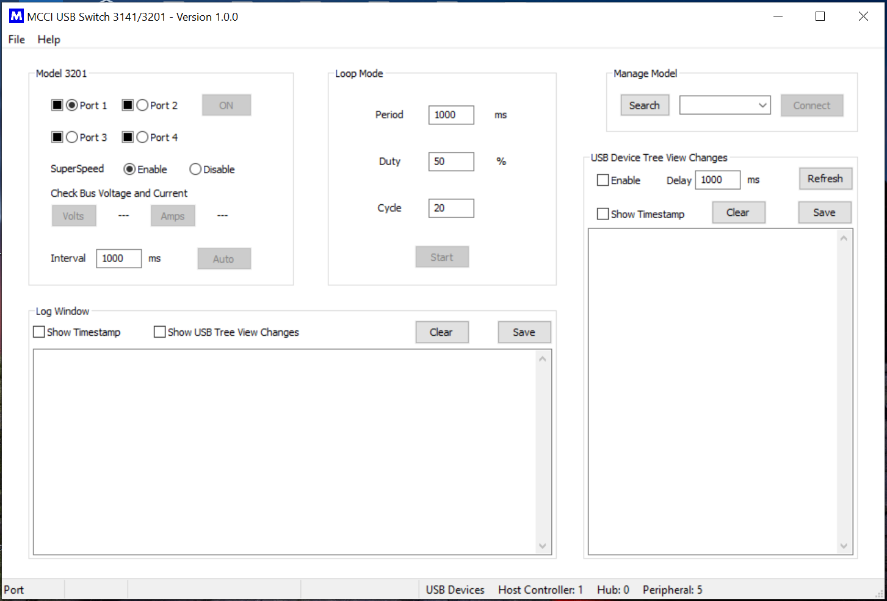

# UI-3141-3201

## List of Contents

<!-- TOC depthFrom:2 updateOnSave:true -->

- [About Application](#about-application)
- [Prerequisites for running or building](#prerequisites-for-running-or-building)
- [Interpret python source](#interpret-python-source)
- [Version change process](#version-change-process)
- [GUI Preview](#gui-preview)

<!-- /TOC -->

## About Application

This application is designed to create simple User Interface for USB Switch 3141 and 3201 , to make the user's interaction as simple and efficient as possible.

It is a cross platform GUI application developed by using WxPython.

## Prerequisites for running or building

<strong>On Windows:</strong>

Development environment

* OS - Windows 10 64 bit
* Python - 3.7.6
* wxpython - 4.0.7.post2
* pyserial - 3.4
* pyusb - 1.0.2
* libusb - 1.0.22b9
* libusb1 - 1.8
* pyinstaller - 3.6 

Download [python3.7.6](https://www.python.org/downloads/release/python-376/) and install

```shell
pip install wxpython==4.0.7.post2
pip install pyserial
pip install pyusb
pip install libusb
pip install libusb1
pip install pyinstaller
```

<strong>On Linux and Mac:</strong>

Development environment

* Linux OS - Ubuntu 20.04 64 bit
* Python - 3.8.2
* Mac OS - High Sierra 10.13.6 64 bit
* Python - 3.7.0
* wxpython - 4.0.7.post2
* pyserial - 3.4
* pyusb - 1.0.2
* libusb - 1.0.22b9
* libusb1 - 1.8
* pyinstaller - 3.6  

```shell
sudo apt-get update
sudo apt-get install python3
sudo apt-get install python3-pip
sudo pip3 install wxpython==4.0.7.post2
sudo pip3 install pyserial
sudo pip3 install pyusb
sudo pip3 install libusb
sudo pip3 install libusb1
sudo pip3 install pyinstaller
```

Note:
* If the installation of wxpython is not success, perform `sudo apt-get install build-essential libgtk-3-dev`
* Some times the installation of wxpython takes longer time (>30 minutes).

## Interpret python source

Move to the directory `destdir/src/`

Run the below command

For Windows 
```shell
python main.py  
```

For Linux and Mac
```shell
python3 main.py
```

## Version change process

To update the version for each release

* Move to the directory `destdir/src/`
* Open the file `uiGlobals.py`
* Update the value of the String Macro `VERSION_STR`
* Update the VERSION.md `destdir/VERSION.md`

## GUI Preview

