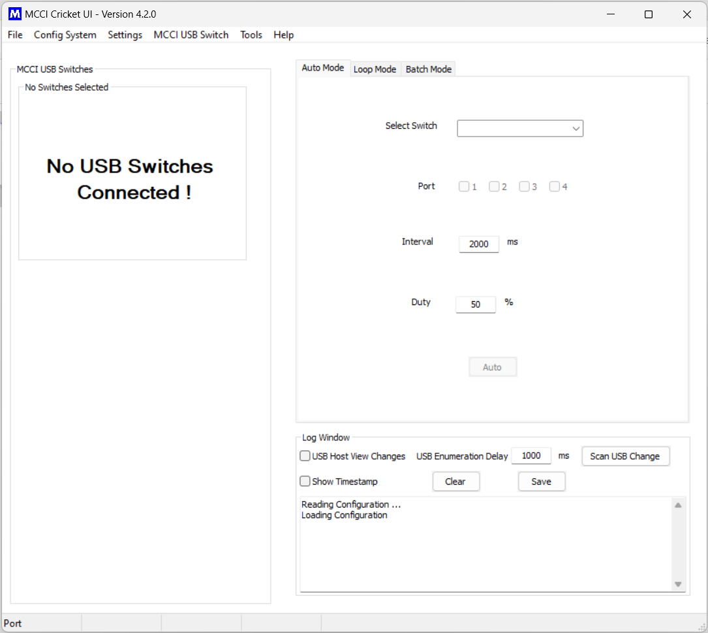
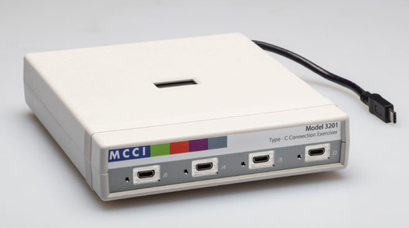
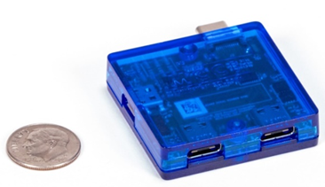
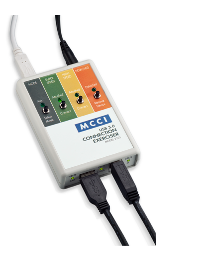
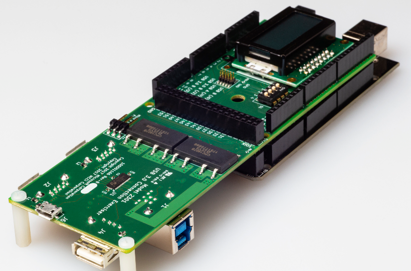

# CricketUI

Simple standalone desktop application for handling MCCI USB Switches in a convenient way. it Supports Model3141, 3201, 2301 and 2101 USB Connection Exerciser.

<!-- /TOC -->
[](https://github.com/mcci-usb/COLLECTION-cricket-ui/releases) [](https://github.com/mcci-usb/COLLECTION-cricket-ui/compare/v2.3.0...master)
<!-- markdown-shield -->

## List of Contents

<!-- TOC depthFrom:2 updateOnSave:true -->

- [About Application](#about-application)
- [Prerequisites for running or building](#prerequisites-for-running-or-building)
- [Interpret python source](#interpret-python-source)
- [Version change process](#version-change-process)
- [GUI Preview](#gui-preview)
- [Release history](#release-history)
- [Visit MCCI Connection Exercisers](#visit-mcci-connection-exercisers)
- [mcci.com](#mcci-product-page) 
- [3201 Enhanced type-c connection exerciser](#To-know-about-MCCI-USB-Model3201)
- [Model 3141 usb switch](#To-know-about-MCCI-USB-Model3141)
- [Model 2101 usb connection exerciser](#To-know-about-MCCI-USB-Model2101)
- [Model 2301 usb connection exerciser](#To-know-about-MCCI-USB-Model2301)
- [Meta](#Meta)


## About Application

This application is designed to create simple User Interface for USB Switch 3141 3201, 2101 and 2301 to make the user's interaction as simple and efficient as possible.

It is a cross platform GUI application developed by using WxPython.

## Prerequisites for running or building

<strong>On Windows:</strong>

Development environment

* OS - Windows 10 64 bit
* Python - 3.7.6
* wxpython - 4.0.7.post2
* pyserial - 3.4
* pyusb - 1.0.2
* libusb - 1.0.22b9
* libusb1 - 1.8
* pyinstaller - 3.6 

Download [python3.7.6](https://www.python.org/downloads/release/python-376/) and install

```shell
pip install wxpython==4.0.7.post2
pip install pyserial
pip install pyusb
pip install libusb
pip install libusb1
pip install pyinstaller
```

<strong>On Linux and Mac:</strong> 

Development environment

* Linux OS - Ubuntu 20.04 64 bit
* Python - 3.8.2
* Mac OS - High Sierra 10.13.6 64 bit
* Python - 3.7.0
* wxpython - 4.0.7.post2
* pyserial - 3.4
* pyusb - 1.0.2
* libusb - 1.0.22b9
* libusb1 - 1.8
* pyinstaller - 3.6  
* hidapi - 0.10.1  - Only for Mac OS

```shell
sudo apt-get update
sudo apt-get install python3
sudo apt-get install python3-pip
sudo pip3 install wxpython==4.0.7.post2
sudo pip3 install pyserial
sudo pip3 install pyusb
sudo pip3 install libusb
sudo pip3 install libusb1
sudo pip3 install pyinstaller
brew install hidapi - Only for Mac OS
```

Note:
* If the installation of wxpython is not success, perform `sudo apt-get install build-essential libgtk-3-dev`
* Some times the installation of wxpython takes longer time (>30 minutes).

<strong>On RaspberryPI:</strong>

Development environment

* Raspberry Pi OS - aarch64 in Ubuntu 20.04 bit
* Python - 3.6.9
* wxgtk-4.0
* pyserial - 3.5
* pyusb - 1.1.1
* libusb - 1.0.23b7
* libusb1 - 1.9
* pyinstaller - 4.2

```shell
sudo add-apt-repository ppa:swt-techie/wxpython4
sudo apt-get update
sudo apt-get install python3-wxgtk4.0
sudo pip3 install pyserial
sudo pip3 install pyusb
sudo pip3 install libusb
sudo pip3 install libusb1
sudo pip3 install pyinstaller
```

Note:
* If the installation of wxpython is not success, perform `sudo apt-get install build-essential libgtk-3-dev`

## Interpret python source

Move to the directory `destdir/src/`

Run the below command

For Windows 
```shell
python main.py  
```

For Linux and Mac
```shell
python3 main.py
```

For RaspberryPi
```shell
python3 main.py
```

## Version change process

To update the version for each release

* Move to the directory `destdir/src/`
* Open the file `uiGlobals.py`
* Update the value of the String Macro `APP_VERSION`
* Update the VERSION.md `destdir/VERSION.md`

## GUI Preview



## Release history
- v2.3.0 includes the following changes.
 
  - Add support for Model 2301 USB Connection Exerciser

- v2.2.0 includes the following changes.

  - Python implemented to Pep8 coding standard.
  -  Package release for Raspberry Pi OS ubuntu18.04

- v2.0.0 includes the following changes.

  - Interface for USB Switch 2101 added.
  - Radio buttons for Port switching replaced by image added buttons.
  - Duty parameter added in auto mode.
  - Until stopped and Port selection option added to the Loop mode and separate panel for Auto mode added, adding USB speed info, increase port switching speed.

- v1.2.0 includes the following changes.
  
  - Removal of File Menu in Mac
  - Interval and Period overriding by USB Device Tree Changes delay
  - Fixing of Host Controller detection issue in Mac (Catalina)
  - Extended Linux support for 16.04 and 18.04


- v1.0.2 includes the following changes.
  
  - App menu and Window menu for Mac OS added
  - New Window item removed from File menu.

- v1.0.0 includes the following changes.

  - UI Panel for Model 3141 and Model 3201
  - Manage models Panel
  - 3141/3201 - Manual, Auto and Loop mode support
  - USB Device Tree View changes and Log Window with Time stamp

## Visit MCCI Connection Exercisers

### To know about MCCI USB Model3201

MCCI Model 3201 Enhanced Type-C Connection Exerciser 

* The MCCI Model 3201 Enhanced Type-C Connection Exerciser (MUTT ConnEX-C) plugs and unplugs up to 4 devices for automated testing of USB Type-C® products. Developed in conjunction with Microsoft, the 3201 is upward compatible with the MCCI Model 3101/Model 3201 Connection Exercisers and the Microsoft MUTT ConnEx-C, but has a number of significant enhancements and improvements.

 For more information about MCCI's Products Model3201, please visit [MCCI Model3201](https://mcci.com/usb/dev-tools/3201-enhanced-type-c-connection-exerciser/)
 
   
   
 ### To know about MCCI USB Model3141

MCCI Model 3141 USB Switch

* The MCCI® Model 3141 USB4™ Switch is a computer-controlled programmable 2:1 switch, connecting two USB Type-C receptacles to a single Type-C plug. It is compatible with USB4 hosts and devices, as well as older protocols such as Thunderbolt™ 3, USB 3.2 gen2 or gen1, USB 2.0, USB Type-C Alternate Modes, and of course Power Delivery. 
The Model 3141 USB4 Switch automates connect/disconnect of one or two devices to a USB Type-C port. It can be used in stress testing, switching between peripherals (for example, a dock and a display), or any automated reconfiguration of a USB Type-C port

For more information about MCCI's Products Model3141, please visit [MCCI Model3141](https://mcci.com/usb/dev-tools/model-3141/).
 
  
  
### To know about MCCI USB Model2101

MCCI Model 2101 USB Connection Exerciser

* The MCCI USB 3.0 Connection Exerciser Model 2101 automatically connects and disconnects a USB 2.0 or 3.2 gen1 host and device under push-button or software control. Connections can be single-stepped or repeated. The manual modes are useful for debugging attach/detach scenarios.  
The Model 3141 USB4 Switch automates connect/disconnect of one or two devices to a USB Type-C port. It can be used in stress testing, switching between peripherals (for example, a dock and a display), or any automated reconfiguration of a USB Type-C port

 For more information about MCCI's Products Model2101, please visit [MCCI Model2101](https://mcci.com/usb/dev-tools/2101-usb-connection-exerciser/).
 
  
  
### To know about MCCI USB Model2301

MCCI Model 2301 Type-A USB 3.2 Gen2 Connection Exerciser

* The MCCI Model 2301 Type-A Connection Exerciser provides a four-to-one USB switch to automate interoperability tests for systems USB 3.2 gen1 or gen2. It uses the supplied Arduino-based controller and electronic switches to electrically plug and unplug any of the four different input ports. The Gen2-capable Type-B plug can be connected to either of two Type-A receptacles, to a Standard-A receptacle (USB 2.0 only), or a Micro-B receptacle (USB 2.0 only). The Type-A Gen2 receptacles support USB 3.2 (gen 1 and gen 2) and USB 2.0 (high speed, full speed and low-speed) devices. The Standard-A receptacle supports USB 2.0 devices. . For more information, see the product home page at www.mcci.com.

For more information about MCCI's Products Model2301, please visit  [MCCI Model2301](https://mcci.com/usb/dev-tools/model-2301/).

 

## Meta

### Licence

This repository is released under the MCCI corporation

### Support Open Source Hardware and Software

MCCI invests time and resources providing this open source code, please support MCCI and open-source hardware by purchasing products from MCCI, Adafruit and other open-source hardware/software vendors!

For information about MCCI's products, please visit [store.mcci.com](https://store.mcci.com/).

### Trademark

MCCI and MCCI Catena are registered trademarks of MCCI Corporation. All other marks are the property of their respective owners.
