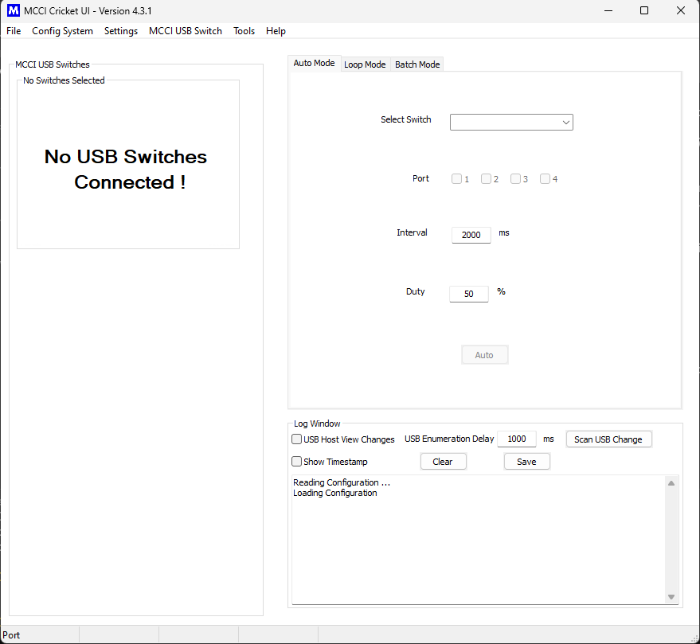

# CricketUI

## List of Contents

<!-- TOC depthFrom:2 updateOnSave:true -->

- [About Application](#about-application)
- [Prerequisites for running or building](#prerequisites-for-running-or-building)
- [Interpret python source](#interpret-python-source)
- [Version change process](#version-change-process)
- [GUI Preview](#gui-preview)

<!-- /TOC -->

## About Application

This application is designed to create simple User Interface for USB Switch 3141 3201 and 2101 , to make the user's interaction as simple and efficient as possible.

It is a cross platform GUI application developed by using WxPython.

## Prerequisites for running or building

<strong>On Windows:</strong>

Development environment

* OS - Windows 10 64 bit
* Python - 3.7.6
* wxpython - 4.0.7.post2
* pyserial - 3.4
* pyusb - 1.0.2
* libusb - 1.0.22b9
* libusb1 - 1.8
* pyinstaller - 3.6 

Download [python3.7.6](https://www.python.org/downloads/release/python-376/) and install

```shell
pip install wxpython==4.0.7.post2
pip install pyserial
pip install pyusb
pip install libusb
pip install libusb1
pip install pyinstaller
```

<strong>On Linux and Mac:</strong>

Development environment

* Linux OS - Ubuntu 20.04 64 bit
* Python - 3.8.2
* Mac OS - High Sierra 10.13.6 64 bit
* Python - 3.7.0
* wxpython - 4.0.7.post2
* pyserial - 3.4
* pyusb - 1.0.2
* libusb - 1.0.22b9
* libusb1 - 1.8
* pyinstaller - 3.6  
* hidapi - 0.10.1  - Only for Mac OS

```shell
sudo apt-get update
sudo apt-get install python3
sudo apt-get install python3-pip
sudo pip3 install wxpython==4.0.7.post2
sudo pip3 install pyserial
sudo pip3 install pyusb
sudo pip3 install libusb
sudo pip3 install libusb1
sudo pip3 install pyinstaller
brew install hidapi - Only for Mac OS
```

Note:
* If the installation of wxpython is not success, perform `sudo apt-get install build-essential libgtk-3-dev`
* Some times the installation of wxpython takes longer time (>30 minutes).

<strong>On RaspberryPI:</strong>

Development environment

* Raspberry Pi OS - aarch64 in Ubuntu 20.04 bit
* Python - 3.6.9
* wxgtk-4.0
* pyserial - 3.5
* pyusb - 1.1.1
* libusb - 1.0.23b7
* libusb1 - 1.9
* pyinstaller - 4.2

```shell
sudo add-apt-repository ppa:swt-techie/wxpython4
sudo apt-get update
sudo apt-get install python3-wxgtk4.0
sudo pip3 install pyserial
sudo pip3 install pyusb
sudo pip3 install libusb
sudo pip3 install libusb1
sudo pip3 install pyinstaller
```

Note:
* If the installation of wxpython is not success, perform `sudo apt-get install build-essential libgtk-3-dev`

## Interpret python source

Move to the directory `destdir/src/`

Run the below command

For Windows 
```shell
python main.py  
```

For Linux and Mac
```shell
python3 main.py
```

For RaspberryPi
```shell
python3 main.py
```

## Version change process

To update the version for each release

* Move to the directory `destdir/src/`
* Open the file `uiGlobals.py`
* Update the value of the String Macro `APP_VERSION`
* Update the VERSION.md `destdir/VERSION.md`

## GUI Preview



## To know about MCCI USB Model3201

MCCI Model 3201 Enhanced Type-C Connection Exerciser 

* The MCCI Model 3201 Enhanced Type-C Connection Exerciser (MUTT ConnEX-C) plugs and unplugs up to 4 devices for automated testing of USB Type-C® products. Developed in conjunction with Microsoft, the 3201 is upward compatible with the MCCI Model 3101/Model 3201 Connection Exercisers and the Microsoft MUTT ConnEx-C, but has a number of significant enhancements and improvements.

 **Link:** For more information, see the product home page at :([MCCI Model 3201 Enhanced Type-C Connection Exerciser ](https://mcci.com/usb/dev-tools/3201-enhanced-type-c-connection-exerciser/))
 
   
   
 ## To know about MCCI USB Model3141

MCCI Model 3141 USB Switch

* The MCCI® Model 3141 USB4™ Switch is a computer-controlled programmable 2:1 switch, connecting two USB Type-C receptacles to a single Type-C plug. It is compatible with USB4 hosts and devices, as well as older protocols such as Thunderbolt™ 3, USB 3.2 gen2 or gen1, USB 2.0, USB Type-C Alternate Modes, and of course Power Delivery. 
The Model 3141 USB4 Switch automates connect/disconnect of one or two devices to a USB Type-C port. It can be used in stress testing, switching between peripherals (for example, a dock and a display), or any automated reconfiguration of a USB Type-C port

 **Link:** For more information, see the product home page at :([MCCI Model 3141 USB Switch](https://mcci.com/usb/dev-tools/model-3141/))
 
  
  
## To know about MCCI USB Model2101

MCCI Model 2101 USB Connection Exerciser

* The MCCI USB 3.0 Connection Exerciser Model 2101 automatically connects and disconnects a USB 2.0 or 3.2 gen1 host and device under push-button or software control. Connections can be single-stepped or repeated. The manual modes are useful for debugging attach/detach scenarios.  
The Model 3141 USB4 Switch automates connect/disconnect of one or two devices to a USB Type-C port. It can be used in stress testing, switching between peripherals (for example, a dock and a display), or any automated reconfiguration of a USB Type-C port

 **Link:** For more information, see the product home page at :([MCCI Model 2101 USB Connection Exerciser](https://mcci.com/usb/dev-tools/2101-usb-connection-exerciser/))
 
  
  
